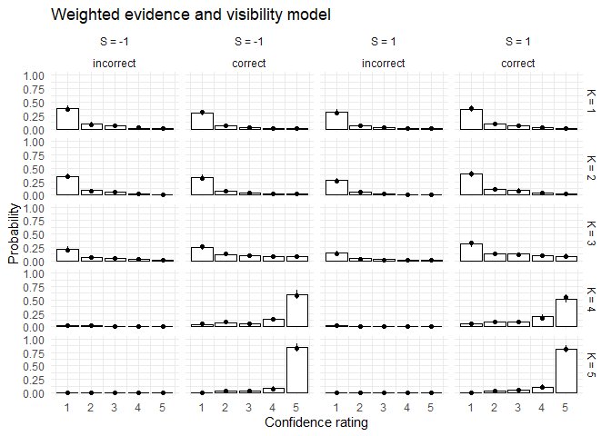

The `statConfR` package provides functions to fit static models of
decision-making and confidence derived from signal detection theory for
binary discrimination tasks, as well as meta-d′/d′ as measures of
metacognition. Fitting models of confidence can be used to test the
assumptions underlying meta-d′/d′. Several models include a
metacognition parameter that may serve as an alternative when the
assumptions of meta-d′/d′ assuming the corresponding model provides a
better fit to the data. The following models are included:

- signal detection rating model (Green & Swets, 1966),
- Gaussian noise model (Maniscalco & Lau, 2016),
- weighted evidence and visibility model (Rausch et al., 2018),
- post-decisional accumulation model (Rausch et al., 2018),
- independent Gaussian model (Rausch & Zehetleitner, 2017),
- independent truncated Gaussian model (the model underlying the
  meta-d′/d′ method, see Rausch et al., 2023),
- lognormal noise model (Shekhar & Rahnev, 2021), and
- lognormal weighted evidence and visibility model (Shekhar & Rahnev,
  2023).

## Mathematical description of implemented models of confidence

The models included in the statConfR package are all based on signal
detection theory (Green & Swets, 1966). It is assumed that participants
select a binary discrimination response $`R`$ about a stimulus $`S`$.
Both $`S`$ and $`R`$ can be either -1 or 1. $`R`$ is considered correct
if $`S=R`$. In addition, we assume that in the experiment, there are
$`K`$ different levels of stimulus discriminability, i.e. a physical
variable that makes the discrimination task easier or harder. For each
level of discriminability, the function fits a different discrimination
sensitivity parameter $`d_k`$. If there is more than one sensitivity
parameter, we assume that the sensitivity parameters are ordered such as
$`0 < d_1 < d_2 < ... < d_K`$. The models assume that the stimulus
generates normally distributed sensory evidence $`x`$ with mean
$`S\times d_k/2`$ and variance of 1. The sensory evidence $`x`$ is
compared to a decision criterion $`c`$ to generate a discrimination
response $`R`$, which is 1, if $`x`$ exceeds $`c`$ and -1 else. To
generate confidence, it is assumed that the confidence variable $`y`$ is
compared to another set of criteria $`\theta_{R,i}, i=1,2,...,L-1`$,
depending on the discrimination response $`R`$ to produce a $`L`$-step
discrete confidence response. The different models vary in how $`y`$ is
generated (see below). The following parameters are shared between all
models:

- sensitivity parameters $`d_1, ..., d_K`$ ($`K`$: number of difficulty
  levels),
- decision criterion $`c`$,
- confidence criterion $`\theta_{-1,1}, ..., \theta_{-1,L-1},
  \theta_{1,1},  ,...,\theta_{1,L-1}`$ ($`L`$: number of confidence
  categories available for confidence ratings).

### Signal detection rating model (SDT)

According to SDT, the same sample of sensory evidence is used to
generate response and confidence, i.e., $`y=x`$. The confidence criteria
associated with $`R=-1`$ are more negative than the decision criterion
$`c`$, whereas the confidence criteria associated with $`R=1`$ are more
positive than $`c`$.

### Gaussian noise model (GN)

According to GN, $`y`$ is subject to additive noise and assumed to be
normally distributed around the decision evidence value $`x`$ with a
standard deviation $`\sigma`$, which is an additional free parameter.

### Weighted evidence and visibility model (WEV)

WEV assumes that the observer combines evidence about decision-relevant
features of the stimulus with the strength of evidence about
choice-irrelevant features to generate confidence. Thus, the WEV model
assumes that $`y`$ is normally distributed with a mean of
$`(1-w)\times x+w \times d_k\times R`$ and standard deviation
$`\sigma`$. The standard deviation quantifies the amount of unsystematic
variability contributing to confidence judgments but not to the
discrimination judgments. The parameter $`w`$ represents the weight that
is put on the choice-irrelevant features in the confidence judgment. The
parameters $`w`$ and $`\sigma`$ are free parameters in addition to the
set of shared parameters.

### Post-decisional accumulation model (PDA)

PDA represents the idea of on-going information accumulation after the
discrimination choice. The parameter $`a`$ indicates the amount of
additional accumulation. The confidence variable is normally distributed
with mean $`x+S\times d_k\times a`$ and variance $`a`$. The parameter
$`a`$ is fitted in addition to the shared parameters.

### Independent Gaussian model (IG)

According to IG, $`y`$ is sampled independently from $`x`$. The variable
$`y`$ is normally distributed with a mean of $`a\times d_k`$ and
variance of 1. The additional parameter $`m`$ represents the amount of
information available for confidence judgment relative to amount of
evidence available for the discrimination decision and can be smaller as
well as greater than 1.

### Independent truncated Gaussian model: HMetad-Version (ITGc)

According to the version of ITG consistent with the HMetad-method
(Fleming, 2017), $`y`$ is sampled independently from $`x`$ from a
truncated Gaussian distribution with a location parameter of
$`S\times d_k \times m/2`$ and a scale parameter of 1. The Gaussian
distribution of $`y`$ is truncated in a way that it is impossible to
sample evidence that contradicts the original decision: If $`R = -1`$,
the distribution is truncated to the right of $`c`$. If $`R = 1`$, the
distribution is truncated to the left of $`c`$. The additional parameter
$`m`$ represents metacognitive efficiency, i.e., the amount of
information available for confidence judgments relative to amount of
evidence available for discrimination decisions and can be smaller as
well as greater than 1.

### Independent truncated Gaussian model: Meta-d’-Version (ITGcm)

According to the version of the ITG consistent with the original meta-d’
method (Maniscalco & Lau, 2012, 2014), $`y`$ is sampled independently
from $`x`$ from a truncated Gaussian distribution with a location
parameter of $`S\times d_k \times m/2`$ and a scale parameter of 1. If
$`R = -1`$, the distribution is truncated to the right of $`m\times c`$.
If $`R = 1`$, the distribution is truncated to the left of
$`m\times c`$. The additional parameter $`m`$ represents metacognitive
efficiency, i.e., the amount of information available for confidence
judgments relative to amount of evidence available for the
discrimination decision and can be smaller as well as greater than 1.

### Logistic noise model (logN)

According to logN, the same sample of sensory evidence is used to
generate response and confidence, i.e., $`y=x`$ just as in SDT. However,
according to logN, the confidence criteria are not assumed to be
constant, but instead they are affected by noise drawn from a lognormal
distribution. In each trial, $`\theta_{-1,i}`$ is given by
$`c -  \epsilon_i`$. Likewise, $`\theta_{1,i}`$ is given by
$`c + \epsilon_i`$. The noise $`\epsilon_i`$ is drawn from a lognormal
distribution with the location parameter
$`\mu_{R,i} = \log(\left| \mu_{\theta_{R,i}} - c\right|)- 0.5 \times \sigma^{2}`$,
and scale parameter $`\sigma`$. $`\sigma`$ is a free parameter designed
to quantify metacognitive ability. It is assumed that the criterion
noise is perfectly correlated across confidence criteria, ensuring that
the confidence criteria are always perfectly ordered. Because
$`\theta_{-1,1}`$, …, $`\theta_{-1,L-1}`$, $`\theta_{1,1}`$, …,
$`\theta_{1,L-1}`$ change from trial to trial, they are not estimated as
free parameters. Instead, we estimate the means of the confidence
criteria, i.e., $`\mu_{\theta_{-1,1}}, ...,
\mu_{\theta_{-1,L-1}}, \mu_{\theta_{1,1}}, ...  \mu_{\theta_{1,L-1}}`$,
as free parameters.

### Logistic weighted evidence and visibility model (logWEV)

The logWEV model is a combination of logN and WEV proposed by .
Conceptually, logWEV assumes that the observer combines evidence about
decision-relevant features of the stimulus with the strength of evidence
about choice-irrelevant features. The model also assumes that noise
affecting the confidence decision variable is lognormal. According to
logWEV, the confidence decision variable is $`y`$ is equal to R × y’.
The variable y’ is sampled from a lognormal distribution with a location
parameter of $`(1-w)\times x\times R + w \times d_k`$ and a scale
parameter of $`\sigma`$. The parameter $`\sigma`$ quantifies the amount
of unsystematic variability contributing to confidence judgments but not
to the discrimination judgments. The parameter $`w`$ represents the
weight that is put on the choice-irrelevant features in the confidence
judgment. The parameters $`w`$ and $`\sigma`$ are free parameters.

## Measures of metacognition

### Meta-d’/d’

The conceptual idea of meta-d′ is to quantify metacognition in terms of
sensitivity in a hypothetical signal detection rating model describing
the primary task, under the assumption that participants had perfect
access to the sensory evidence and were perfectly consistent in placing
their confidence criteria (Maniscalco & Lau, 2012, 2014). Using a signal
detection model describing the primary task to quantify metacognition
allows a direct comparison between metacognitive accuracy and
discrimination performance because both are measured on the same scale.
Meta-d′ can be compared against the estimate of the distance between the
two stimulus distributions estimated from discrimination responses,
which is referred to as d′: If meta-d′ equals d′, it means that
metacognitive accuracy is exactly as good as expected from
discrimination performance. If meta-d′ is lower than d′, it means that
metacognitive accuracy is not optimal. It can be shown that the implicit
model of confidence underlying the meta-d’/d’ method is identical to
different versions of the independent truncated Gaussian model (Rausch
et al., 2023), depending on whether the original model specification by
Maniscalco and Lau (2012) or alternatively the specification by Fleming
(2017) is used. We strongly recommend to test whether the independent
truncated Gaussian models are adequate descriptions of the data before
quantifying metacognitive efficiency with meta-d′/d′.

## Installation

The latest released version of the package is available on CRAN via

    install.packages("statConfR")

The easiest way to install the development version is using `devtools`
and install from GitHub:

    devtools::install_github("ManuelRausch/StatConfR")

<!-- without any dots, the code chunk will be shown, but not executed -->

## Usage

### Example data set

The package includes a demo data set from a masked orientation
discrimination task with confidence judgments (Hellmann et al., 2023,
Exp. 1).

``` r
library(statConfR)
data("MaskOri")
head(MaskOri)
```

    ##   participant stimulus correct rating diffCond trialNo
    ## 1           1        0       1      0      8.3       1
    ## 2           1       90       0      4    133.3       2
    ## 3           1        0       1      0     33.3       3
    ## 4           1       90       0      0     16.7       4
    ## 5           1        0       1      3    133.3       5
    ## 6           1        0       1      0     16.7       6

### Fitting

The function `fitConfModels` allows the user to fit several confidence
models separately to the data of each participant. The data should be
provided via the argument `.data` in the form of a data.frame object
with the following variables in separate columns: - stimulus (factor
with 2 levels): The property of the stimulus which defines which
response is correct - diffCond (factor): The experimental manipulation
that is expected to affect discrimination sensitivity - correct (0-1):
Indicating whether the choice was correct (1) or incorrect(0). - rating
(factor): A discrete variable encoding the decision confidence (high:
very confident; low: less confident) - participant (integer): giving the
subject ID. The argument `model` is used to specify which model should
be fitted, with ‘WEV’, ‘SDT’, ‘GN’, ‘PDA’, ‘IG’, ‘ITGc’, ‘ITGcm’,
‘logN’, and ‘logWEV’ as available options. If model=“all” (default), all
implemented models will be fit, although this may take a while.

Setting the optional argument `.parallel=TRUE` parallizes model fitting
over all but 1 available core. Note that the fitting procedure takes may
take a considerable amount of time, especially when there are multiple
models, several difficulty conditions, and/or several confidence
categories. For example, if there are five difficulty conditions and
five confidence levels, fitting the WEV model to one single participant
may take 20-30 minutes on a 2.8GHz CPU. We recommend parallelization to
keep the required time tolerable.

``` r
fitted_pars <- fitConfModels(MaskOri, models=c("ITGcm", "WEV"), .parallel = TRUE) 
```

The output is then a data frame with one row for each combination of
participant and model and separate columns for each estimated parameter
as well as for different measures for goodness-of-fit (negative
log-likelihood, BIC, AIC and AICy<sub>c</sub>). These may be used for
statistical model comparisons.

``` r
head(fitted_pars)
```

    ##   model participant negLogLik    N  k      BIC     AICc      AIC        d_1
    ## 1 ITGcm           1  2719.492 1620 15 5549.837 5469.247 5468.985 0.02791587
    ## 2   WEV           1  2621.110 1620 16 5360.464 5274.520 5274.221 0.20268438
    ## 3 ITGcm           2  1926.296 1620 15 3963.445 3882.854 3882.592 0.01889636
    ## 4   WEV           2  1827.221 1620 16 3772.684 3686.741 3686.441 0.05119639
    ## 5 ITGcm           3  1695.957 1620 15 3502.766 3422.176 3421.914 0.32340627
    ## 6   WEV           3  1661.617 1620 16 3441.476 3355.533 3355.233 0.41460563
    ##          d_2       d_3      d_4      d_5          c theta_minus.4 theta_minus.3
    ## 1 0.43212223 1.0210704 3.472310 4.395496 -0.2499098     -1.584000     -1.055322
    ## 2 0.61422596 1.0796567 3.474608 4.079890 -0.2957338     -2.066516     -1.248524
    ## 3 0.06496444 0.6926183 4.209053 5.463259 -0.1068211     -2.109575     -2.009674
    ## 4 0.19195858 1.0412267 4.142295 5.288622 -0.1474590     -2.044069     -1.950015
    ## 5 0.60550967 2.3776478 7.924170 9.428593 -1.2804566     -1.793311     -1.448681
    ## 6 0.85608686 2.7115290 6.916448 7.986348 -1.3742943     -2.762529     -1.919228
    ##   theta_minus.2 theta_minus.1 theta_plus.1 theta_plus.2 theta_plus.3
    ## 1    -0.6463512    -0.4645142  -0.09770594    0.2168548    1.0019751
    ## 2    -0.4151617     0.1296425  -0.61959026    0.1544368    1.3976350
    ## 3    -1.4620933    -0.9950160   0.78839560    1.4081014    2.1950659
    ## 4    -1.3982493    -0.9030114   0.82007352    1.4484447    2.2446957
    ## 5    -1.0652684    -0.9656961  -0.92027462   -0.6053266    0.3337906
    ## 6    -0.3723945     0.9327974  -2.76951959   -1.1312635    0.7714093
    ##   theta_plus.4         m     sigma         w         wAIC        wAICc
    ## 1    1.6044716 1.1177354        NA        NA 5.099723e-43 5.196487e-43
    ## 2    2.1879187        NA 1.0104584 0.5361153 1.000000e+00 1.000000e+00
    ## 3    2.3601086 1.5701944        NA        NA 2.549474e-43 2.597848e-43
    ## 4    2.4029896        NA 0.6390763 0.5019978 1.000000e+00 1.000000e+00
    ## 5    0.9382662 0.7404757        NA        NA 3.315175e-15 3.378078e-15
    ## 6    1.7520050        NA 1.3288815 0.3817864 1.000000e+00 1.000000e+00
    ##           wBIC
    ## 1 7.551090e-42
    ## 2 1.000000e+00
    ## 3 3.774970e-42
    ## 4 1.000000e+00
    ## 5 4.908733e-14
    ## 6 1.000000e+00

It can be seen that the independent truncated Gaussian model is
consistently outperformed by the weighted evidence and visibility model,
which is why we would not recommend using meta-d′/d′ for this specific
task.

### Visualization

After obtaining model fits, it is strongly recommended to visualize the
prediction implied by the best fitting sets of parameters and to compare
the prediction with the actual data. The best way to visualize the data
is highly specific to the data set and research question, which is why
`statConfR` does not come with its own visualization tools. This being
said, here is an example for how a visualization could look like:

<!-- Stuff where only the code should be shown and executed, but do not show R yapping  -->

``` r
library(tidyverse)
AggregatedData <- MaskOri %>%
  mutate(ratings = as.numeric(rating), diffCond = as.numeric(diffCond)) %>%
  group_by(participant, diffCond, correct ) %>% 
  dplyr::summarise(ratings=mean(ratings,na.rm=T)) %>%
  Rmisc::summarySEwithin(measurevar = "ratings",
                         withinvars = c("diffCond", "correct"), 
                         idvar = "participant",
                         na.rm = TRUE, .drop = TRUE) %>% 
  mutate(diffCond = as.numeric(diffCond))
AggregatedPrediction <- 
  rbind(fitted_pars %>%
          filter(model=="ITGcm") %>%
          group_by(participant) %>%
          simConf(model="ITGcm") %>% 
          mutate(model="ITGcm"), 
        fitted_pars %>%
          filter(model=="WEV") %>%
          group_by(participant) %>%
          simConf(model="WEV") %>% 
          mutate(model="WEV")) %>%
  mutate(ratings = as.numeric(rating) ) %>%
  group_by(participant, diffCond, correct, model ) %>% 
  dplyr::summarise(ratings=mean(ratings,na.rm=T)) %>%
  Rmisc::summarySEwithin(measurevar = "ratings",
                  withinvars = c("diffCond", "correct", "model"), 
                  idvar = "participant",
                  na.rm = TRUE, .drop = TRUE) %>% 
  mutate(diffCond = as.numeric(diffCond))
PlotMeans <- 
  ggplot(AggregatedPrediction, 
         aes(x = diffCond, y = ratings, color = correct)) + facet_grid(~ model) +
   ylim(c(1,5)) + 
   geom_line() +  ylab("confidence rating") + xlab("difficulty condition") +
   scale_color_manual(values = c("darkorange", "navy"),
                     labels = c("Error", "Correct response"), name = "model prediction") + 
  geom_errorbar(data = AggregatedData, 
                aes(ymin = ratings-se, ymax = ratings+se), color="black") + 
  geom_point(data = AggregatedData, aes(shape=correct), color="black") + 
  scale_shape_manual(values = c(15, 16),
                     labels = c("Error", "Correct response"), name = "observed data") 
```

<!-- Show both the code and the output Figure!  -->

``` r
PlotMeans
```

<figure>

<figcaption aria-hidden="true">Predicted vs. observed confidence as a
function of discriminability and correctness</figcaption>
</figure>

### Measuring metacognition

Assuming that the independent truncated Gaussian model provides a decent
account of the data (notably, this is not the case though in the demo
data set), the function `fitMetaDprime` can be used to estimate
meta-d′/d′ independently for each subject. The arguments `.data` and
`.parallel=TRUE` just in the same way the arguments of `fitConfModels`.
The argument `model` offers the user the choice between two model
specifications, either “ML” to use the original model specification used
by Maniscalco and Lau (2012, 2014) or “F” to use the model specification
by Fleming (2017)’s Hmetad method.

``` r
MetaDs <- fitMetaDprime(data = MaskOri, model="ML", .parallel = TRUE)
```

### Documentation

The documentation of each function of the currently installed version of
`statConfR` can be accessed by typing ?*functionname* into the console.

## Contributing to the package

The package is under active development. We are planning to implement
new models of decision confidence when they are published. Please feel
free to [contact us](malto::manuel.rausch@ku.de) to suggest new models
to implement in in the package, or to volunteer adding additional
models.

### Instruction for implementing custom models of decision confidence

**Only recommended for users with experience in cognitive modelling!**
For readers who want to use our open code to implement models of
confidence themselves, the following steps need to be taken:

- Derive the likelihood of a binary response ($`R=-1, 1`$) and a
  specific level of confidence ($`C=1,...K`$) according to the custom
  model and a set of parameters, given the binary stimulus
  ($`S=-1, 1`$), i.e. $`P(R, C | S)`$.
- Use one of the files named ‘int_ll*model*.R’ from the package sources
  and adapt the likelihood function according to your model. According
  to our convention, name the new file a ‘int_ll*yourmodelname*.R’. Note
  that all parameters are fitted on the reals, i.e. positive parameters
  should be transformed outside the log-likelihood function (e.g. using
  the logarithm) and back-transformed within the log-likelihood function
  (e.g. using the exponential).
- Use one of the files ‘int_fit*model*.R’ from the package sources and
  adapt the fitting function to reflect the new model.
  - The initial grid used during the grid search should include a
    plausible range of all parameters of your model.
  - If applicable, the parameters of the initial grid needs be
    transformed so the parameter vector for optimization is
    real-valued).
  - The optimization routine should call the new log-likelihood
    function.
  - If applicable, the parameter vector i obtained during optimization
    needs to back-transformation for the the output object `res`.
  - Name the new file according to the convention
    ‘int_fit*yourmodelname*.R’.
- Add your model and fitting-functions to the high-level functions
  `fitConf` and `fitConfModels`.
- Add a simulation function in the file ‘int_simulateConf.R’ which uses
  the same structure as the other functions but adapt the likelihood of
  the responses.

## Contact

For comments, bug reports, and feature suggestions please feel free to
write to either <manuel.rausch@hochschule-rhein-waal.de> or
<sebastian.hellmann@ku.de> or [submit an
issue](https://github.com/ManuelRausch/StatConfR/issues).

## References

- Fleming, S. M. (2017). HMeta-d: Hierarchical Bayesian estimation of
  metacognitive efficiency from confidence ratings. Neuroscience of
  Consciousness, 1, 1–14. <https://doi.org/10.1093/nc/nix007>
- Green, D. M., & Swets, J. A. (1966). Signal detection theory and
  psychophysics. Wiley.
- Hellmann, S., Zehetleitner, M., & Rausch, M. (2023). Simultaneous
  modeling of choice, confidence, and response time in visual
  perception. Psychological Review, 130(6), 1521–1543.
  <https://doi.org/10.1037/rev0000411>
- Maniscalco, B., & Lau, H. (2012). A signal detection theoretic method
  for estimating metacognitive sensitivity from confidence ratings.
  Consciousness and Cognition, 21(1), 422–430.
  <https://doi.org/10.1016/j.concog.2011.09.021>
- Maniscalco, B., & Lau, H. (2016). The signal processing architecture
  underlying subjective reports of sensory awareness. Neuroscience of
  Consciousness, 1, 1–17. <https://doi.org/10.1093/nc/niw002>
- Maniscalco, B., & Lau, H. C. (2014). Signal Detection Theory Analysis
  of Type 1 and Type 2 Data: Meta-d, Response- Specific Meta-d, and the
  Unequal Variance SDT Model. In S. M. Fleming & C. D. Frith (Eds.), The
  Cognitive Neuroscience of Metacognition (pp. 25–66). Springer.
  <https://doi.org/10.1007/978-3-642-45190-4_3>
- Rausch, M., Hellmann, S., & Zehetleitner, M. (2018). Confidence in
  masked orientation judgments is informed by both evidence and
  visibility. Attention, Perception, and Psychophysics, 80(1), 134–154.
  <https://doi.org/10.3758/s13414-017-1431-5>
- Rausch, M., & Zehetleitner, M. (2017). Should metacognition be
  measured by logistic regression? Consciousness and Cognition, 49,
  291–312. <https://doi.org/10.1016/j.concog.2017.02.007>
- Shekhar, M., & Rahnev, D. (2021). The Nature of Metacognitive
  Inefficiency in Perceptual Decision Making. Psychological Review,
  128(1), 45–70. <https://doi.org/10.1037/rev0000249>
- Shekhar, M., & Rahnev, D. (2024). How Do Humans Give Confidence? A
  Comprehensive Comparison of Process Models of Perceptual
  Metacognition. Journal of Experimental Psychology: General, 153(3),
  656–688. <https://doi.org/10.1037/xge0001524>
